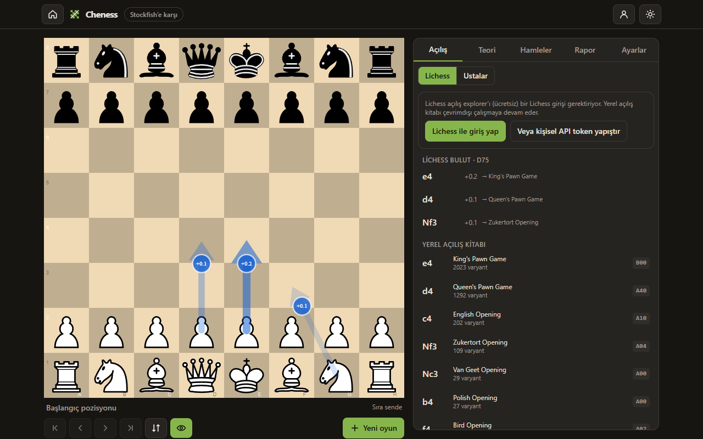
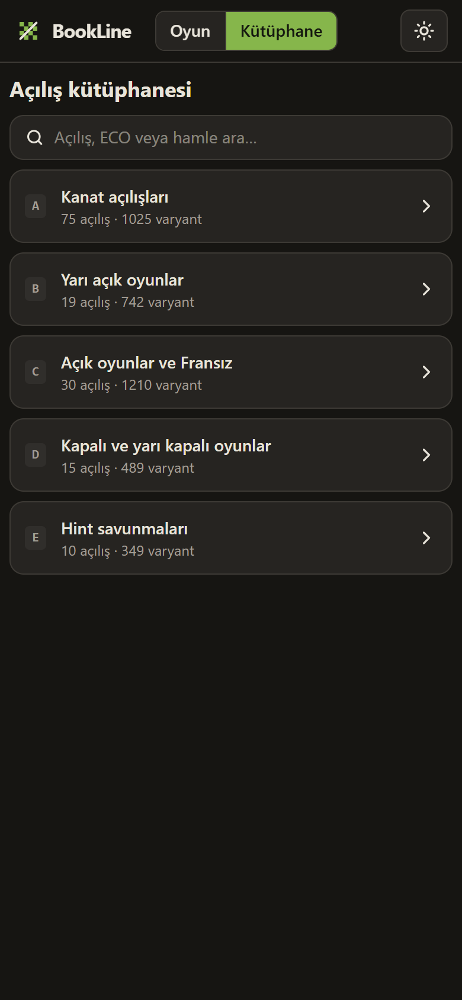
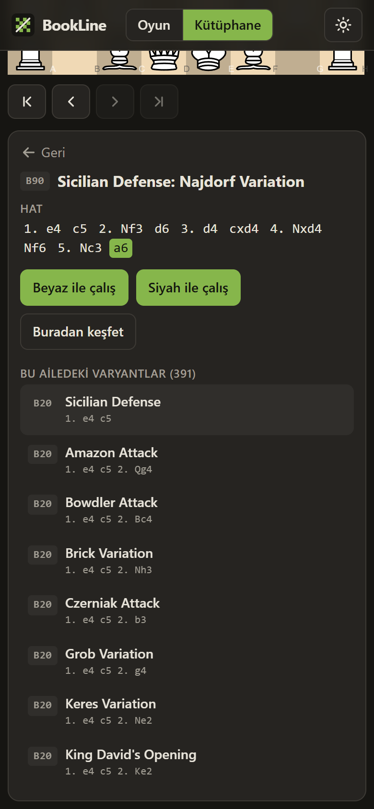

# BookLine — Chess Opening Trainer

Mobile-first, fully client-side chess opening trainer. Play against Stockfish in the browser
while a live panel under the board tells you **which opening and variation you are in**, shows
the **most popular continuations with Lichess-style win/draw/loss bars**, and names the
variation each continuation leads to. Take over the opponent's moves whenever you want to
steer the game into the line you are studying, and browse **every named opening and
variation** (3,800+ from the Lichess opening database) offline.

| Play (desktop)                                  | Library (mobile)                                | Variation detail (mobile)                                      |
| ----------------------------------------------- | ----------------------------------------------- | -------------------------------------------------------------- |
|  |  |  |

_Screenshots are taken from an automated headless-Chrome run without a Lichess login, so the
explorer panel shows the offline book; log in to see the Lichess statistics._

## Features

- **Board & rules** — [chessground](https://github.com/lichess-org/chessground) (Lichess's board)
  with touch drag/tap, [chess.js](https://github.com/jhlywa/chess.js) for legality, FEN, SAN.
  Undo/redo, move list navigation, flip, promotion picker, new game as White/Black/random.
- **Bot** — Stockfish 19 (lite, single-threaded WASM) in a Web Worker. Six difficulty levels
  (`Skill Level` + `movetime`/`depth`), changeable at any time; the new level applies to the
  bot's next move. Runs offline; no SharedArrayBuffer / COOP-COEP headers needed.
- **Move analysis** — Lichess cloud evaluations (deep Stockfish, free, no login) when both
  positions of a move are known, otherwise a second, full-strength local Stockfish instance;
  it grades every move
  (Book / Best / Great / Excellent / Good / Inaccuracy / Mistake / Blunder) from the
  win-probability it gives away, using Lichess's published thresholds, and shows the engine's
  preferred move after a mistake. Badges in the move list, verdict + eval bar under the
  board; depth is configurable (or off).
- **Live opening panel (tutor)** — after every move: ECO code + opening + variation
  ("out of book" sticks to the last known name), popular continuations from the Lichess
  Opening Explorer (Lichess pool with rating/time-control filters, or the Masters database),
  each with its play share, a three-colour W/D/L bar and the variation it leads to.
  Tap a move to preview it as an arrow, tap again to play it. Works on the opponent's turn
  too ("show opponent hints").
- **Takeover mode** — "I move for the opponent": the bot pauses and you play both sides;
  turn it off and the bot continues from the current position. Long-press (or tap twice) a
  continuation on the bot's turn to play that move for the opponent once.
- **Home screen & modes** — Play (choose side and level), Analyse (paste a PGN from Lichess /
  chess.com or a Lichess game link), Play with a friend (pass-and-play on one device, board
  turns each move), Openings and Library.
- **Arrows** — the eye button draws the three most played continuations on the board, fading
  with popularity like Lichess; when there is no explorer data it draws the engine's top three
  moves instead (Lichess cloud evaluation when available, otherwise local Stockfish).
- **Openings screen** — the most played openings for White and for Black (with live Lichess
  shares when logged in), each with Practice / Explore / all variations.
- **Theory tab** — human-written opening theory for the current line from Wikibooks'
  _Chess Opening Theory_ (CC BY-SA, English), falling back to the nearest covered parent line.
- **My games** — pull your recent games from Lichess or chess.com (public APIs), review any
  of them with the engine report, and see which openings you play and how you score in each.
- **Engine data sources** — Lichess cloud evaluations, ChessDB (chessdb.cn) scores and local
  Stockfish, in that order of preference.
- **Offline opening book** — the `lichess-org/chess-openings` dataset (CC0) is embedded and
  keyed by EPD, so opening names and named continuations work with no network, and
  transpositions resolve correctly.
- **Opening library** — browse ECO volumes A–E → opening families → every variation, search
  by name/ECO, step through each line on a board, then "Practice as White/Black" (bot plays
  the other side from that position) or "Explore from here".
- **PWA** — installable, dark theme by default, all assets and the engine precached for
  offline use. Explorer responses are cached in IndexedDB; requests are debounced and back
  off on HTTP 429.
- **UI in Turkish and English** (auto-detected, switchable).

## Tech stack

| Concern | Choice                                                                   |
| ------- | ------------------------------------------------------------------------ |
| App     | Vite 8 + React 19 + TypeScript, Tailwind CSS 4, Zustand (single store)   |
| Board   | `@lichess-org/chessground` 10 (the unscoped `chessground` is deprecated) |
| Rules   | chess.js 1.4                                                             |
| Engine  | Stockfish 19 lite single-thread WASM (`nmrugg/stockfish.js`)             |
| Data    | Lichess Opening Explorer API; `lichess-org/chess-openings` TSV (CC0)     |
| Tests   | Vitest (pure modules: rules, book, percentages, UCI parsing)             |
| Tooling | ESLint 10 + Prettier; Python venv for the data pipeline                  |
| Deploy  | GitHub Pages via GitHub Actions                                          |
| Backend | none — everything runs in the browser                                    |

## Project layout

```
src/
  engine/      Stockfish worker wrapper (UCI), difficulty table, bot hook
  explorer/    Lichess explorer client, IndexedDB cache, offline book, controller
  game/        chess.js wrapper: history, cursor, FEN/EPD/SAN/UCI helpers
  store/       Zustand store (game, settings, UI modes, explorer results)
  components/  Board, OpeningPanel, MoveList, Controls, SettingsPanel, ...
  pages/       PlayPage, LibraryPage
  i18n/        tr/en dictionaries
  data/        openings.json (generated)
public/stockfish/  engine .js/.wasm + GPL notice
tools/             Python data pipeline (chess-openings TSV -> openings.json), icon generator
```

## Development

Requirements: Node.js ≥ 20.19 (24 LTS recommended) and, only for regenerating data, Python 3.12+.

```bash
npm install
npm run dev          # starts Vite with --host; open the printed LAN URL on your phone
npm test             # vitest
npm run lint
npm run build        # tsc -b && vite build -> dist/
npm run preview
npm run smoke -- http://localhost:5173/   # headless-Chrome end-to-end check (needs Chrome installed)
```

`npm run smoke` drives the running app (moves by click and touch, bot reply, move analysis,
opening panel, library, practice mode) and writes screenshots to `smoke-shots/`.

### Regenerating the opening book / icons (Python venv)

```bash
python -m venv .venv
.venv/Scripts/python -m pip install chess pillow      # (Linux/macOS: .venv/bin/python)
.venv/Scripts/python tools/build_openings.py           # -> src/data/openings.json
.venv/Scripts/python tools/make_icons.py               # -> public/icon-*.png
```

Update `tools/chess-openings/*.tsv` from
<https://github.com/lichess-org/chess-openings> before rebuilding.

### Updating the engine

`npm run fetch-engine` downloads the pinned Stockfish build into `public/stockfish/`.
Current files (Stockfish 19.0.0, lite single-thread):

| File                            | SHA-256                                                            |
| ------------------------------- | ------------------------------------------------------------------ |
| `stockfish-19-lite-single.js`   | `d3344124ab067fb0b90ee77873bb8e9fbf5fc01bc525fe714b0f942581e889e6` |
| `stockfish-19-lite-single.wasm` | `57ac2d72312aba346760e3f173f687a8c211208e97a87268436f7f0e10bb5387` |

## Architecture notes & decisions

- **Explorer endpoint** — the current Lichess docs give `https://explorer.lichess.org`
  (`/lichess`, `/masters`); the older `explorer.lichess.ovh` host from the brief is not used.
  **Since mid-2026 the explorer rejects anonymous requests (HTTP 401)**, so the app offers
  "Log in with Lichess" (OAuth2 authorization code + PKCE, fully client-side, no scopes) and,
  as a fallback, a field for a personal API token. The token stays in this device's
  localStorage and is sent only to `explorer.lichess.org` / `lichess.org`. Without a login
  the panel falls back to the offline book.
  Requests pass `fen` (EPD), `moves=12`, `topGames=0`, `recentGames=0`, and for the Lichess
  pool `speeds` + `ratings` (allowed buckets: 0, 1000, …, 2200, 2500). Every returned move
  carries its own `opening {eco, name}`, which is what the panel uses for "leads to".
- **Request hygiene** — one request per viewed position at most: 250 ms debounce, memory +
  IndexedDB cache (14 days), in-flight requests aborted on navigation, 60 s back-off on 429,
  no fetch on the bot's turn unless opponent hints are enabled.
- **Opening names** come from the embedded book (same source Lichess uses), so the name under
  the board updates instantly and works offline; the API is used for statistics.
- **Engine build** — `stockfish` npm ships 200 MB of builds, so only the two lite single-thread
  files are vendored under `public/stockfish/`. The single-thread build needs no
  cross-origin-isolation headers, which keeps GitHub Pages hosting trivial.
- **Difficulty** — `src/engine/difficulty.ts` maps six levels to `Skill Level` 0–20 plus a
  `movetime`/`depth` pair. The Elo labels are rough estimates on a Lichess/FIDE-like scale
  (chess.com ratings usually run 100–300 lower); they are not calibrated against any
  platform. The level is read when the bot starts thinking, so a change applies from its
  next move.
- **Report accuracy** — per-move accuracy uses Lichess's curve
  `103.1668·e^(−0.04354·loss) − 3.1669`, averaged per side; the game report lists every
  inaccuracy/mistake/blunder with the engine's preferred move.
- **History model** — linear history with a cursor; playing from an earlier position
  discards the future (no variation tree in the MVP). Undo against the bot steps back to
  your own turn.
- **License** — chessground and Stockfish are GPL-3.0; a combined work distributed to users
  must be GPL-compatible, so BookLine is licensed **GPL-3.0-or-later** (the brief suggested
  MIT, which would not be compliant).

## Roadmap

- "Brilliant" detection (sacrifices) and per-game accuracy score.
- A demo GIF in this README.
- Repertoire saving and spaced-repetition drills.
- Import games from Lichess / Chess.com accounts.
- Notation and puzzle modes.

## Credits

- Stockfish and the [stockfish.js](https://github.com/nmrugg/stockfish.js) WASM port (GPL-3.0)
- [chessground](https://github.com/lichess-org/chessground) (GPL-3.0),
  [chess.js](https://github.com/jhlywa/chess.js) (BSD-2-Clause)
- [lichess-org/chess-openings](https://github.com/lichess-org/chess-openings) (CC0), the
  [Lichess Opening Explorer](https://lichess.org/api#tag/Opening-Explorer) and
  [Lichess cloud evaluations](https://lichess.org/api#tag/Analysis)
- [Wikibooks: Chess Opening Theory](https://en.wikibooks.org/wiki/Chess_Opening_Theory)
  (CC BY-SA 4.0), [ChessDB](https://www.chessdb.cn/), the
  [chess.com public API](https://www.chess.com/news/view/published-data-api)

## License

GPL-3.0-or-later. See [LICENSE](LICENSE).
